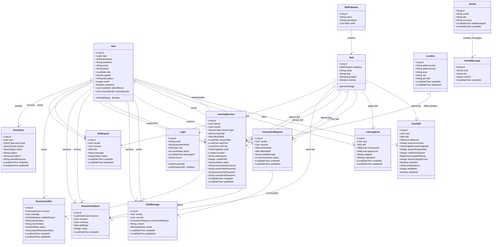

```mermaid
classDiagram

    %% =========================
    %% USER & AUTHENTICATION
    %% =========================

    class User {
        +Long id
        +Login login
        +String firstName
        +String lastName
        +String email
        +String phone
        +LocalDate dob
        +Gender gender
        +String description
        +Integer credit
        +Boolean isDeleted
        +List~UserSkill~ skillsOffered
        +List~LearningGoal~ learningGoals
        +isOfValidAge() Boolean
    }

    class Login {
        +Long id
        +String email
        +String passwordHash
        +RoleType role
        +AccountStatus status
        +LocalDateTime lastLoginAt
        +String reason
        +hashPassword()
        +verifyPassword() Boolean
    }

    User "1" --> "1" Login : authentication


    %% =========================
    %% SKILL MANAGEMENT
    %% =========================

    class SkillCategory {
        +Long id
        +String name
        +String description
        +List~Skill~ skills
    }

    class Skill {
        +Long id
        +SkillCategory category
        +String name
        +String slug
        +String description
        +Boolean isActive
        +generateSlug()
    }

    SkillCategory "1" --> "0..*" Skill : contains


    %% =========================
    %% USER SKILLS & LEARNING GOALS
    %% =========================

    class UserSkill {
        +Long id
        +User user
        +Skill skill
        +SkillLevel skillLevel
        +Integer experienceYears
        +TeachingMode teachingMode
        +Integer sessionDurationMin
        +Integer creditsPerSession
        +BigDecimal avgSkillRating
        +Integer learnersTaughtCount
        +Boolean isVerified
        +String testQuestions
        +Integer testMarks
        +Boolean isDeleted
    }

    class LearningGoal {
        +Long id
        +User user
        +Skill skill
        +SkillLevel currentLevel
        +SkillLevel targetLevel
        +String roadplan
        +Boolean isDeleted
        +LocalDateTime createdAt
        +LocalDateTime updatedAt
    }

    User "1" --> "0..*" UserSkill : offers
    Skill "1" --> "0..*" UserSkill : offered by
    User "1" --> "0..*" LearningGoal : learning goals
    Skill "1" --> "0..*" LearningGoal : target skill


    %% =========================
    %% CONNECTION REQUEST & CHAT
    %% =========================

    class ConnectionRequest {
        +Long id
        +User sender
        +User receiver
        +Skill primarySkill
        +Skill offeredSkill
        +String initialMessage
        +ConnectionStatus status
        +LocalDateTime createdAt
        +LocalDateTime updatedAt
    }

    class ChatMessage {
        +Long id
        +User sender
        +User receiver
        +ConnectionRequest connectionRequest
        +String content
        +MessageStatus status
        +LocalDateTime createdAt
        +LocalDateTime updatedAt
    }

    User "1" --> "0..*" ConnectionRequest : sends
    User "1" --> "0..*" ConnectionRequest : receives
    Skill "1" --> "0..*" ConnectionRequest : primary skill
    Skill "0..1" --> "0..*" ConnectionRequest : offered skill

    ConnectionRequest "1" --> "0..*" ChatMessage : conversation
    User "1" --> "0..*" ChatMessage : sends
    User "1" --> "0..*" ChatMessage : receives


    %% =========================
    %% LEARNING SESSION & FEEDBACK
    %% =========================

    class LearningSession {
        +Long id
        +User learner
        +User mentor
        +SessionType sessionType
        +Skill primarySkill
        +Skill offeredSkill
        +LocalDate sessionDate
        +LocalTime startTime
        +LocalTime endTime
        +TeachingMode mode
        +Location location
        +String meetingLink
        +Integer creditsHeld
        +SessionStatus status
        +String learnerStartPassword
        +String mentorStartPassword
        +String learnerEndPassword
        +String mentorEndPassword
        +LocalDateTime createdAt
        +LocalDateTime updatedAt
    }

    class SessionFeedback {
        +Long id
        +LearningSession session
        +User reviewer
        +User reviewee
        +Skill skillRated
        +Integer rating
        +LocalDateTime createdAt
    }

    User "1" --> "0..*" LearningSession : learner
    User "1" --> "0..*" LearningSession : mentor
    Skill "1" --> "0..*" LearningSession : primary skill
    Skill "0..1" --> "0..*" LearningSession : offered skill
    Location "0..1" --> "0..*" LearningSession : offline location

    LearningSession "1" --> "0..*" SessionFeedback : feedback
    User "1" --> "0..*" SessionFeedback : reviews
    User "1" --> "0..*" SessionFeedback : reviewed
    Skill "1" --> "0..*" SessionFeedback : rated skill


    %% =========================
    %% SESSION CONFLICT
    %% =========================

    class SessionConflict {
        +Long id
        +LearningSession session
        +User raisedBy
        +ConflictReason conflictReason
        +String learnerStory
        +String mentorStory
        +ConflictStatus status
        +String adminResolutionNotes
        +LocalDateTime createdAt
        +LocalDateTime updatedAt
    }

    LearningSession "1" --> "0..1" SessionConflict : conflict
    User "1" --> "0..*" SessionConflict : raises


    %% =========================
    %% SKILL INQUIRY & USER QUERIES
    %% =========================

    class SkillInquiry {
        +Long id
        +User sender
        +User receiver
        +Skill skill
        +String message
        +InquiryStatus status
        +LocalDateTime createdAt
        +LocalDateTime updatedAt
    }

    class UserQuery {
        +Long id
        +User user
        +QueryType queryType
        +QueryPriority priority
        +QueryStatus status
        +String subject
        +String description
        +String adminResponse
        +LocalDateTime createdAt
        +LocalDateTime updatedAt
    }

    User "1" --> "0..*" SkillInquiry : sends
    User "1" --> "0..*" SkillInquiry : receives
    Skill "1" --> "0..*" SkillInquiry : requested skill

    User "1" --> "0..*" UserQuery : submits


    %% =========================
    %% LOCATION
    %% =========================

    class Location {
        +Long id
        +String addressLine1
        +String addressLine2
        +String area
        +String city
        +String pincode
        +LocalDateTime createdAt
        +LocalDateTime updatedAt
    }


    %% =========================
    %% AI ASSISTANT CHAT
    %% =========================

    class AiChat {
        +String id
        +String userId
        +String title
        +String summary
        +LocalDateTime lastMessageAt
        +LocalDateTime createdAt
    }

    class AiChatMessage {
        +String id
        +AiChat chat
        +String role
        +Object content
        +LocalDateTime createdAt
    }

    AiChat "1" --> "0..*" AiChatMessage : contains messages
```