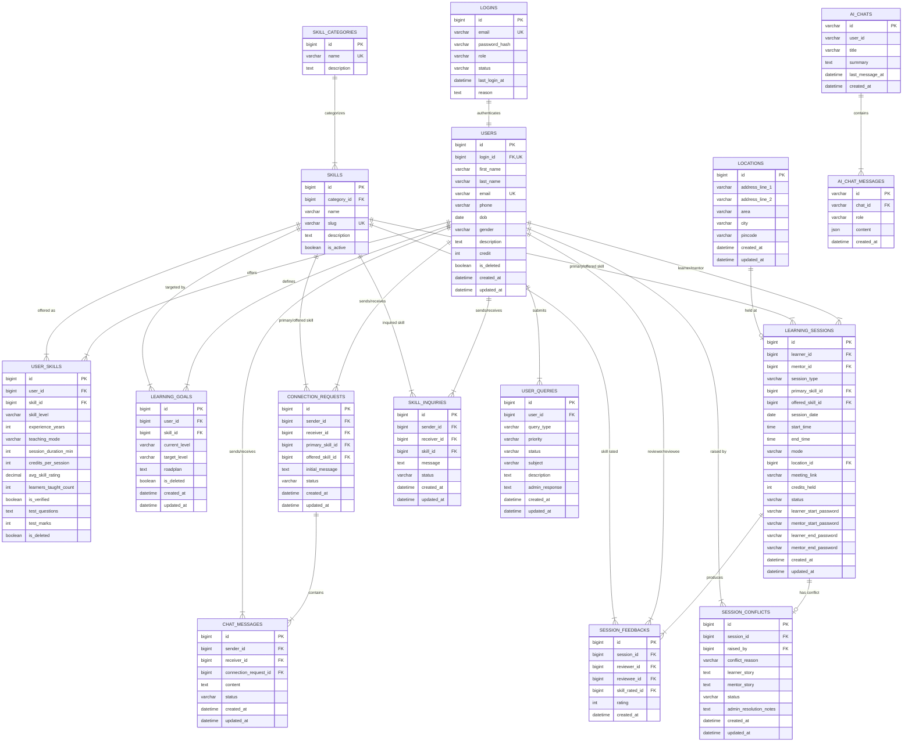

# OpenPetal Database Schema Diagram

```mermaid
erDiagram

    LOGINS ||--|| USERS : "authenticates"
    SKILL_CATEGORIES ||--|{ SKILLS : "categorizes"
    USERS ||--|{ USER_SKILLS : "offers"
    SKILLS ||--|{ USER_SKILLS : "offered as"
    USERS ||--|{ LEARNING_GOALS : "defines"
    SKILLS ||--|{ LEARNING_GOALS : "targeted by"
    USERS ||--|{ CONNECTION_REQUESTS : "sends/receives"
    SKILLS ||--|{ CONNECTION_REQUESTS : "primary/offered skill"
    CONNECTION_REQUESTS ||--|{ CHAT_MESSAGES : "contains"
    USERS ||--|{ CHAT_MESSAGES : "sends/receives"
    USERS ||--|{ LEARNING_SESSIONS : "learner/mentor"
    SKILLS ||--|{ LEARNING_SESSIONS : "primary/offered skill"
    LOCATIONS ||--o| LEARNING_SESSIONS : "held at"
    LEARNING_SESSIONS ||--|{ SESSION_FEEDBACKS : "produces"
    USERS ||--|{ SESSION_FEEDBACKS : "reviewer/reviewee"
    SKILLS ||--|{ SESSION_FEEDBACKS : "skill rated"
    LEARNING_SESSIONS ||--o| SESSION_CONFLICTS : "has conflict"
    USERS ||--|{ SESSION_CONFLICTS : "raised by"
    USERS ||--|{ SKILL_INQUIRIES : "sends/receives"
    SKILLS ||--|{ SKILL_INQUIRIES : "inquired skill"
    USERS ||--|{ USER_QUERIES : "submits"
    AI_CHATS ||--|{ AI_CHAT_MESSAGES : "contains"

    LOGINS {
        bigint id PK
        varchar email UK
        varchar password_hash
        varchar role
        varchar status
        datetime last_login_at
        text reason
    }

    USERS {
        bigint id PK
        bigint login_id FK,UK
        varchar first_name
        varchar last_name
        varchar email UK
        varchar phone
        date dob
        varchar gender
        text description
        int credit
        boolean is_deleted
        datetime created_at
        datetime updated_at
    }

    SKILL_CATEGORIES {
        bigint id PK
        varchar name UK
        text description
    }

    SKILLS {
        bigint id PK
        bigint category_id FK
        varchar name
        varchar slug UK
        text description
        boolean is_active
    }

    USER_SKILLS {
        bigint id PK
        bigint user_id FK
        bigint skill_id FK
        varchar skill_level
        int experience_years
        varchar teaching_mode
        int session_duration_min
        int credits_per_session
        decimal avg_skill_rating
        int learners_taught_count
        boolean is_verified
        text test_questions
        int test_marks
        boolean is_deleted
    }

    LEARNING_GOALS {
        bigint id PK
        bigint user_id FK
        bigint skill_id FK
        varchar current_level
        varchar target_level
        text roadplan
        boolean is_deleted
        datetime created_at
        datetime updated_at
    }

    LOCATIONS {
        bigint id PK
        varchar address_line_1
        varchar address_line_2
        varchar area
        varchar city
        varchar pincode
        datetime created_at
        datetime updated_at
    }

    CONNECTION_REQUESTS {
        bigint id PK
        bigint sender_id FK
        bigint receiver_id FK
        bigint primary_skill_id FK
        bigint offered_skill_id FK
        text initial_message
        varchar status
        datetime created_at
        datetime updated_at
    }

    CHAT_MESSAGES {
        bigint id PK
        bigint sender_id FK
        bigint receiver_id FK
        bigint connection_request_id FK
        text content
        varchar status
        datetime created_at
        datetime updated_at
    }

    LEARNING_SESSIONS {
        bigint id PK
        bigint learner_id FK
        bigint mentor_id FK
        varchar session_type
        bigint primary_skill_id FK
        bigint offered_skill_id FK
        date session_date
        time start_time
        time end_time
        varchar mode
        bigint location_id FK
        varchar meeting_link
        int credits_held
        varchar status
        varchar learner_start_password
        varchar mentor_start_password
        varchar learner_end_password
        varchar mentor_end_password
        datetime created_at
        datetime updated_at
    }

    SESSION_FEEDBACKS {
        bigint id PK
        bigint session_id FK
        bigint reviewer_id FK
        bigint reviewee_id FK
        bigint skill_rated_id FK
        int rating
        datetime created_at
    }

    SESSION_CONFLICTS {
        bigint id PK
        bigint session_id FK
        bigint raised_by FK
        varchar conflict_reason
        text learner_story
        text mentor_story
        varchar status
        text admin_resolution_notes
        datetime created_at
        datetime updated_at
    }

    SKILL_INQUIRIES {
        bigint id PK
        bigint sender_id FK
        bigint receiver_id FK
        bigint skill_id FK
        text message
        varchar status
        datetime created_at
        datetime updated_at
    }

    USER_QUERIES {
        bigint id PK
        bigint user_id FK
        varchar query_type
        varchar priority
        varchar status
        varchar subject
        text description
        text admin_response
        datetime created_at
        datetime updated_at
    }

    AI_CHATS {
        varchar id PK
        varchar user_id
        varchar title
        text summary
        datetime last_message_at
        datetime created_at
    }

    AI_CHAT_MESSAGES {
        varchar id PK
        varchar chat_id FK
        varchar role
        json content
        datetime created_at
    }
```
