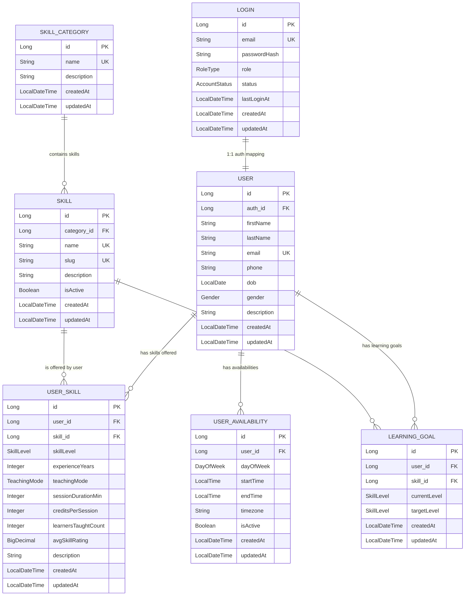

# Open Petal Backend - Entity Schema Diagram

The following is an Entity-Relationship (ER) diagram representing all entities and their relationships in the project.

```mermaid
---
id: 4fc13a52-00a3-4ed4-ae06-c08fdfba049d
---
erDiagram
    LOGIN ||--|| USER : "1:1 auth mapping"
    USER ||--o{ USER_SKILL : "has skills offered"
    SKILL ||--o{ USER_SKILL : "is offered by user"
    USER ||--o{ LEARNING_GOAL : "has learning goals"
    SKILL ||--o{ LEARNING_GOAL : "is learning target"
    USER ||--o{ USER_AVAILABILITY : "has availabilities"
    SKILL_CATEGORY ||--o{ SKILL : "contains skills"

    LOGIN {
        Long id PK
        String email UK
        String passwordHash
        RoleType role
        AccountStatus status
        LocalDateTime lastLoginAt
        LocalDateTime createdAt
        LocalDateTime updatedAt
    }

    USER {
        Long id PK
        Long auth_id FK
        String firstName
        String lastName
        String email UK
        String phone
        LocalDate dob
        Gender gender
        String description
        LocalDateTime createdAt
        LocalDateTime updatedAt
    }

    SKILL_CATEGORY {
        Long id PK
        String name UK
        String description
        LocalDateTime createdAt
        LocalDateTime updatedAt
    }

    SKILL {
        Long id PK
        Long category_id FK
        String name UK
        String slug UK
        String description
        Boolean isActive
        LocalDateTime createdAt
        LocalDateTime updatedAt
    }

    LEARNING_GOAL {
        Long id PK
        Long user_id FK
        Long skill_id FK
        SkillLevel currentLevel
        SkillLevel targetLevel
        LocalDateTime createdAt
        LocalDateTime updatedAt
    }

    USER_AVAILABILITY {
        Long id PK
        Long user_id FK
        DayOfWeek dayOfWeek
        LocalTime startTime
        LocalTime endTime
        String timezone
        Boolean isActive
        LocalDateTime createdAt
        LocalDateTime updatedAt
    }

    USER_SKILL {
        Long id PK
        Long user_id FK
        Long skill_id FK
        SkillLevel skillLevel
        Integer experienceYears
        TeachingMode teachingMode
        Integer sessionDurationMin
        Integer creditsPerSession
        Integer learnersTaughtCount
        BigDecimal avgSkillRating
        String description
        LocalDateTime createdAt
        LocalDateTime updatedAt
    }
```
